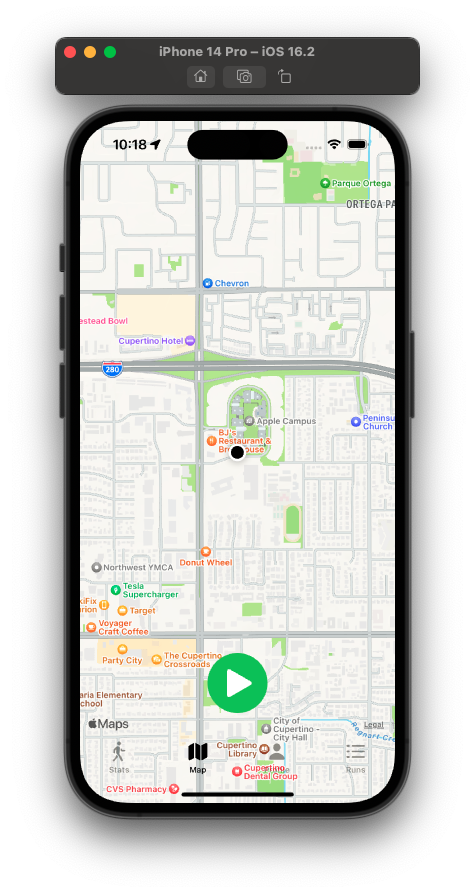

# Running App

This app collects GPS data in order to present the following information:

- Speed
- Average Speed
- Duration
- Distance
- Calories

Watch the demo

## Views

The app has 4 views

### Status view

The status view presents the current workout status and it is updated based on GPS data.

### Map view

The map view shows the map and has the controller to start/stop the workout.

### Profile view

The profile view has some configurations that are used in the app to calculate or present data,
such as the weight of the person and the speed unit respectively.

### Runs view

The last view presents the previous exercises, it consists of a list and a detail page.

## Data storage

Two storages are being used.

The UserDefaults are used to store the profile data and the run's history that uses Core Data.

## How to run

Import the project on XCode and run the app. Give the app GPS permission when required. 
In order to simulate the data you can go to Simulator Screen > Features > Location > City run.
Click on the map icon, hit play, and go back to the Stats screen to see the data changing.
